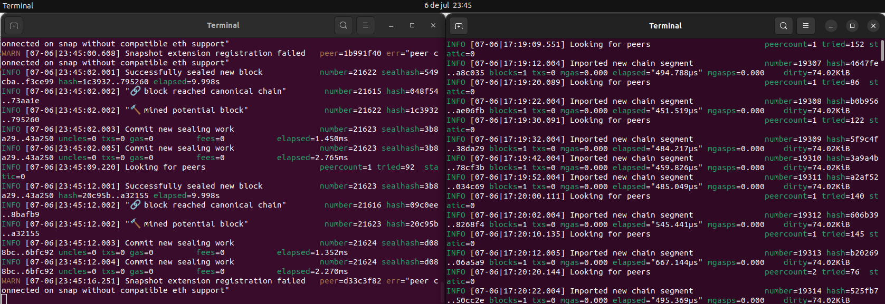
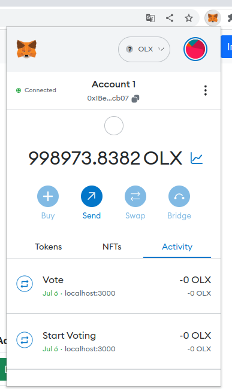
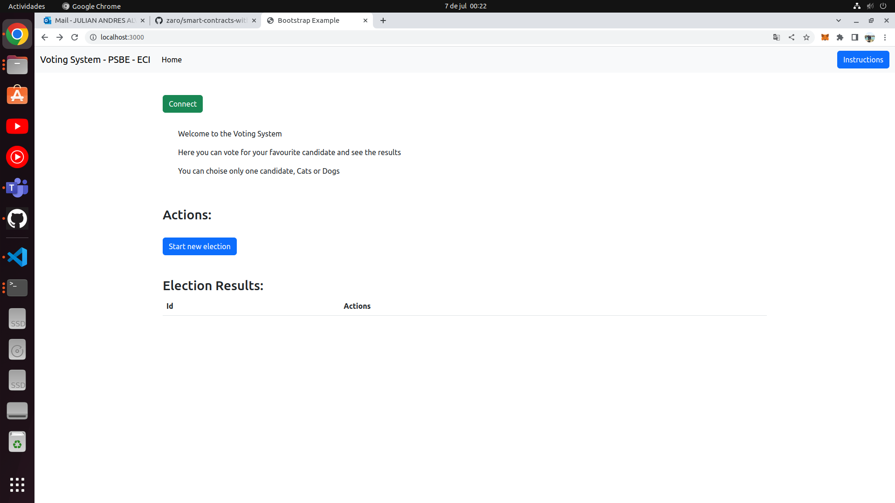
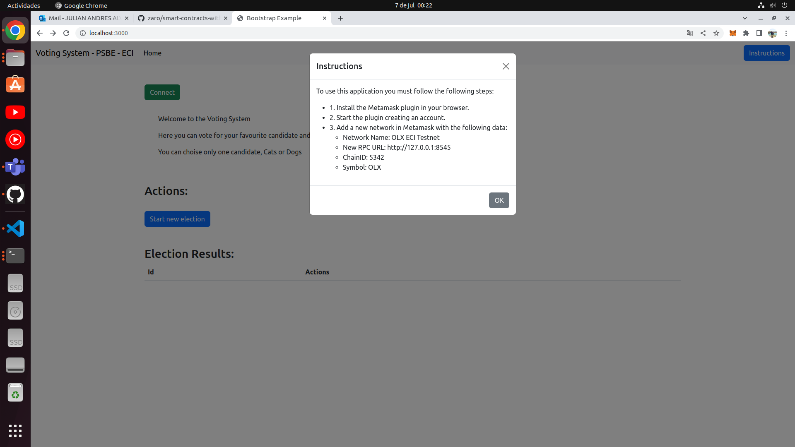
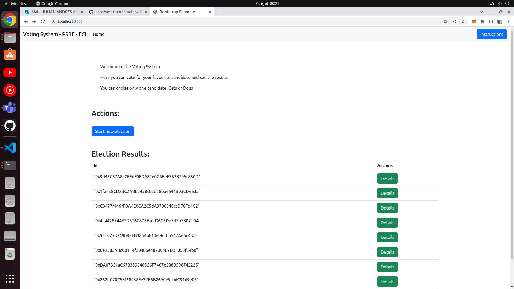
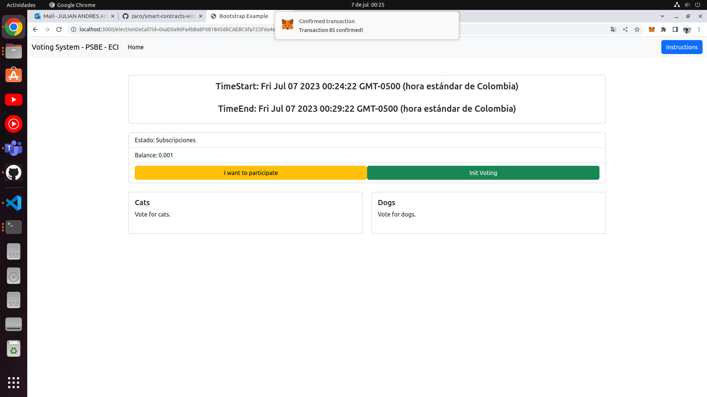
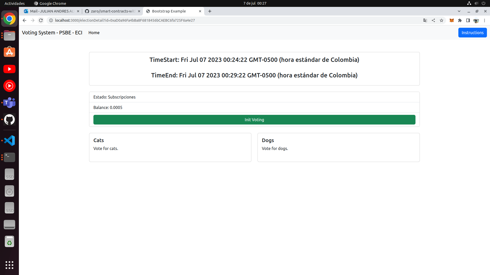
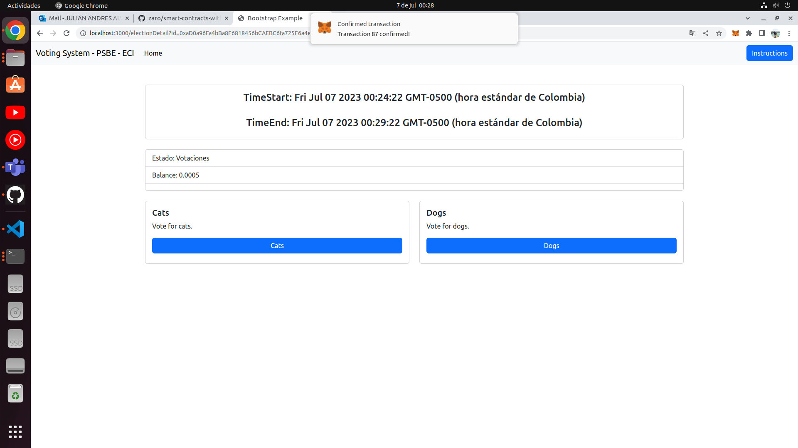
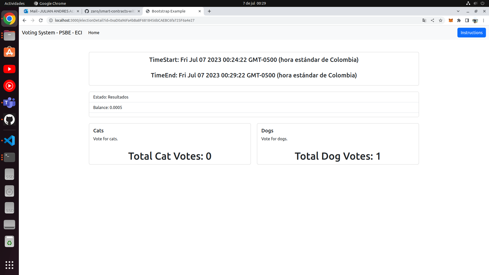

# VotingSystem

## Description

This is a voting system in blockchain that allows users to vote for a candidate and see the results of the election, you can vote only once and you can't change your vote.

You can vote for Dogs or Cats.

This exercise is based on course smart-contracts-with-solidity from School of Engineering Julio Garavito.

https://github.com/zaro/smart-contracts-with-solidity

https://github.com/MetaMask/detect-provider

## Getting Started

run your private blockchain 



## Usage
```run the following command in your terminal```

    npx hardhat compile

```run the following command in your terminal```

    npx hardhat test

```deploy the contract in your private blockchain```

    npx hardhat run scripts/deploy.js --network local

copy the contract address and paste it in the index.html and electionDetail file in contractAddress variable

```run the index.html file in your browser```


Install metamask extension in your browser and create an account.



Connect metamask to your private blockchain.




See the instructions in the page



Start new election, and see the list of all elections created.




Star the election, subscribe to the election and vote for a candidate.




reload the page init the election.



vote for a candidate.



reload the page and see the results.

